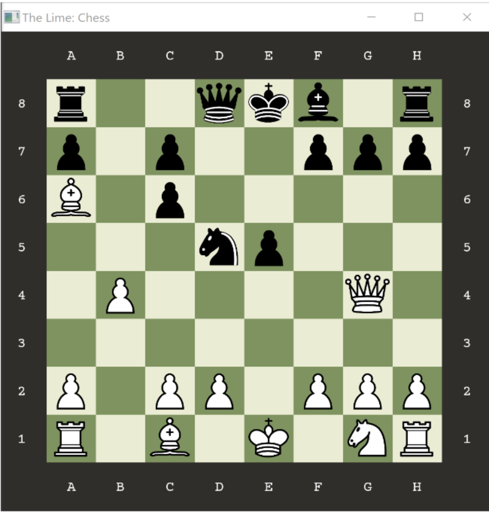

# Chess

## Team 
Team Members:

 	- Yen Hao Wang (Rick Wang), (https://github.com/apo11o-M)
  
 	- Derrason Towery, https://github.com/Dtowe002
  
  	- Maya Treves, https://github.com/mtgym2
   
   	- Nicholas Martinez (Nicko), https://github.com/nickocruzm
  
Our team met both in person and online. Collaboration was necessary for all project components. Confident stating, each member made valued contributions to this project and provided support to one another when confronted with challenges.

## Installation/Usage
1. Run `cmake .` in the root of the repo to generate the makefile.
2. Run `make` to compile the project, this may take a while.
3. Run the `./main` executable
4. The command line will prompt the user to input the coordinates to control the chess pieces, first the coordinate of the chess piece that you want to move, then the final destination of that chess piece.

## External Libraries
1. Simple and Fast Multimedia Library (SFML), [https://github.com/SFML/SFML.git]
2. Google Testing, [https://github.com/google/googletest.git]

## Project Overview
- Developed Chess application
- Written in C++ 
- Developed graphical and command line interfaces.
- User has the option to play against another user or computer.
- Documentation below provides a further insights to project design.

## User Input

Coordinate system used to determine piece locations, is aligned with the coordinate system used in chess. Positions are made up of two componenets (R,C).

$$ \text{Row index }, (R) = \[1, 8\] $$

$$ \text{Column index }, (C) = \[A, H\] $$

$$ \text{Position }, (P) = (R,C) $$

### Graphical User Interface

 
## Class Diagram

